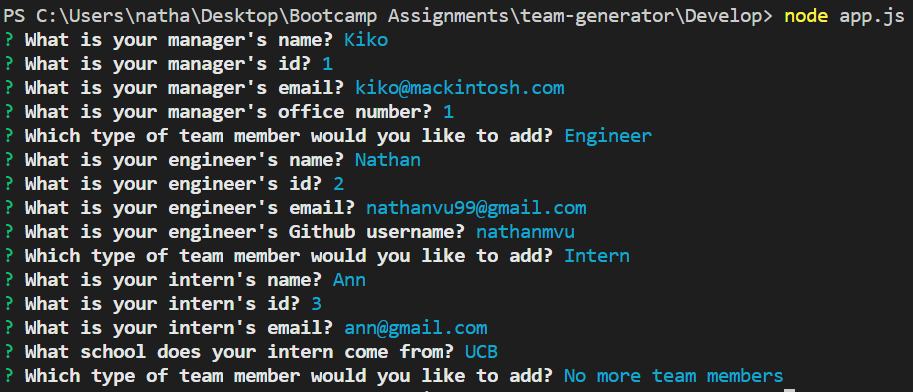
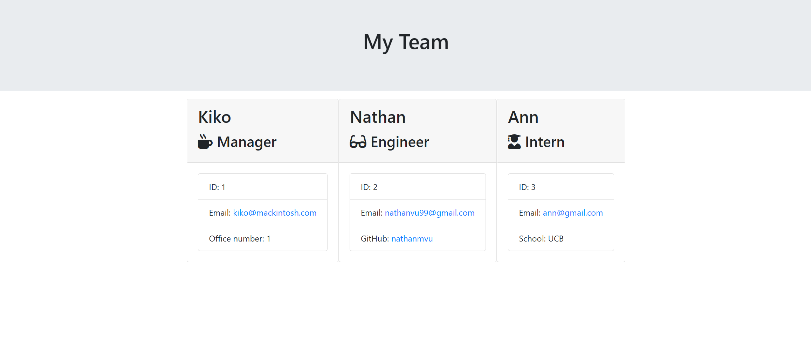

# Team Generator
A software engineering team generator command line application

## Description
This program is a command line application to generate a website containing information on your software engineering team and it's members. Information on the generated page will be based on the user response to prompts on the integrated terminal regarding team member information starting with the manager. Each employee inputted will require different information but, in general, all employees require a name, id, and email address to be inputted. The generated page will contain all user input about the team in an organized HTML file where employees are separated by cards indicating their roles and personal information.

## Table of Contents
* [Getting Started](#getting-started)
* [Installation](#installation)
* [Usage](#usage)
* [Author](#author)
* [Acknowledgments](#acknowledgments)
* [License](#license)

## Getting Started
* [Github Repository](https://github.com/nathanmvu/password-generator)
* [Usage Demo Video](https://drive.google.com/file/d/14rFG7i_9Mj7pS_ROhEpMp-Ojkt3oGMvo/view)

## Installation
This project uses Node.js so it will need to be installed in order to operate the application.
To install the project, download it from the Github repository. Running the program will require running:
```javascript
npm install
```
in the integrated terminal. Afterwards, in the integrated terminal for the app.js file run:
```javascript
node app.js
```
and the application should begin prompting you with questions about your team.

## Usage
* Command Line Prompts:


* Generated HTML:


## Author
* Nathan Vu
* [Github](https://github.com/nathanmvu)
* [Email](mailto:nathanvu99@gmail.com)

## Acknowledgments
* Project parameters provided by the UCB Extension Coding Bootcamp

## License
[](https://github.com/tterb/atomic-design-ui/blob/master/LICENSEs)
